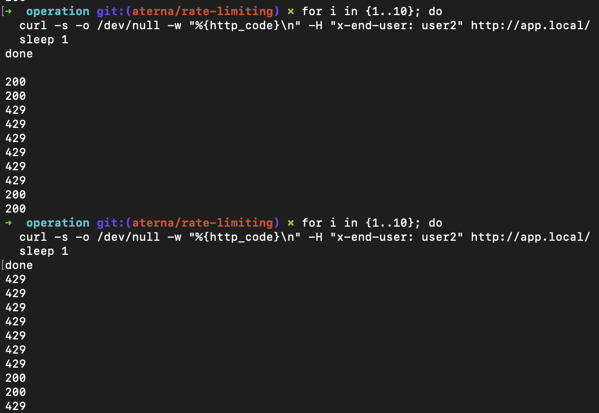

<<<<<<< HEAD
# Operation

This repository contains an overview of the services and deployment procedures for using the Sentiment Analysis application.

## 📚 Table of Contents

- [Structure](#structure)
- [🛠 Application](#-application)
- [🚀 Local Deployment](#-deployment)
  - [🐳 Docker Compose](#-docker-compose)
  - [🔄 Docker Swarm](#-docker-swarm-deployment)
- [☸️ Kubernetes Cluster via Vagrant](#️-kubernetes-via-vagrant)
  - [🧪 Testing Kubernetes Cluster Configuration](#-testing-kubernetes-configuration)
- [🚀 Kubernetes Orchestration and Deployment](#️-k8s-orchestration)
- [⚓ Helm](#-helm)
- [🌐 Istio Traffic Routing](#-istio-traffic-routing)
- [🔎 Monitoring](#-monitoring)
- [⚙️ GitHub Actions & CI/CD](#️-github-actions--cicd)
- [Use of Gen AI](#-gen-ai)

## [Structure](#structure)

This repository is organized according to the following structure:

```
operation/
├── .github/
│   └── workflows/             # CI/CD workflow definitions
│       └── release.yml        # Release automation workflow
│
├── environments/              # Environment variable files
│   ├── app.env                # App service environment variables
│   └── model-service.env      # Model service environment variables
│
├── helm_chart/                # Helm chart for Kubernetes deployment
│   ├── Chart.yaml             # Chart metadata
│   ├── values.yaml            # Default configuration values
│   ├── grafana/               # Grafana dashboard definitions
│   │   └── main_dashboard.json # Main monitoring dashboard
│   └── templates/             # Kubernetes resource templates
│       ├── app-deployment.yaml            # App service deployment
│       ├── app-destinationrule.yaml       # Istio destination rules for app
│       ├── app-ingress.yaml               # Ingress for app service
│       ├── app-service-monitor.yaml       # Prometheus monitoring config
│       ├── istio-gateway.yaml             # Istio gateway configuration
│       ├── istio-virtual-service.yaml     # Istio traffic routing rules
│       ├── model-service-deployment.yaml  # Model service deployment
│       ├── model-service-destinationrule.yaml # Istio rules for model service
│       ├── model-service-virtualservice.yaml  # Istio routing for model service
│       ├── prometheus-rule.yaml           # Prometheus alerting rules
│       ├── secrets.yaml                   # Secret management
│       └── additional configuration files...
│
├── k8s/                       # Kubernetes resources for direct application
│   ├── app-deployment.yaml    # App service deployment
│   ├── app-ingress.yaml       # Ingress configuration
│   └── model-service-deployment.yaml # Model service deployment
│
├── provisioning/              # Ansible playbooks for K8s configuration
│   ├── ctrl.yml               # Controller node configuration
│   ├── general.yml            # General node configuration
│   ├── node.yml               # Worker node configuration
│   ├── finalization.yml       # Final cluster setup
│   ├── istioconfig.yml        # Istio service mesh configuration
│   ├── ip-address-pool.yaml   # MetalLB IP configuration
│   ├── l2-advertisement.yaml  # MetalLB L2 configuration
│   ├── certificate-issuer.yaml # Certificate management
│   ├── dashboard-adminuser.yml # Kubernetes dashboard user
│   ├── dashboard-ingress.yaml  # Dashboard access configuration
│   └── templates/             # Template files for provisioning
│       └── hosts.j2           # Host template
│
├── public-keys/               # SSH public keys for VM access
│   └── id_ed25519_*.pub       # Team member public keys
│
├── scripts/                   # Utility scripts
│   ├── run.bash               # Script to set up SSH keys and start VMs
│   ├── generate_key.bash      # Script to generate SSH keys
│   ├── destroy.bash           # Script to tear down VMs
│   └── config_k8s.sh          # Script to setup local K8s connection
│
├── secretsDocker/             # Secret files for secure Docker deployment
│   └── example_secret.txt     # Example secret file
│
├── shared-folder/             # Shared volume mount for VMs
│   └── readme.txt             # Shared folder documentation
│
├── ssh/                       # SSH keys for VM authentication
│   ├── id_rsa                 # Private key
│   └── id_rsa.pub             # Public key
│
├── docker-compose.yml         # Docker Compose file for local deployment
├── Vagrantfile                # VM provisioning for Kubernetes cluster
├── admin.conf                 # Kubernetes admin configuration
├── GitVersion.yml             # Configuration for semantic versioning
├── activity.md                # Team activity tracking
├── Project-information.md     # Project overview and requirements
├── README.md                  # This documentation file
└── LICENSE                    # MIT license file
```

## [🛠 Application](#-application)

Our Sentiment Analysis application is implemented across multiple services and repositories, each focusing on a specific part of the system:

| Repository                                                         | Description                                                                                      |
| ------------------------------------------------------------------ | ------------------------------------------------------------------------------------------------ |
| [model-training](https://github.com/remla25-team17/model-training) | Handles training and evaluation of the sentiment analysis model.                                 |
| [model-service](https://github.com/remla25-team17/model-service)   | Flask API that serves the trained model for real-time predictions.                               |
| [lib-ml](https://github.com/remla25-team17/lib-ml)                 | Shared machine learning utilities and preprocessing code used by both training and service apps. |
| [app](https://github.com/remla25-team17/app)                       | The main application that connects to the `model-service` and exposes user-facing endpoints.     |
| [lib-version](https://github.com/remla25-team17/lib-version)       | Provides versioning utilities to keep services aligned and trackable.                            |

Each of these components works together to deliver an end-to-end sentiment analysis pipeline, from training to real-time predictions.

---

## [🚀 Deployment](#-deployment)

To deploy the application, we use a **Docker Compose setup** that runs both the application and the model service using pre-built images from the **GitHub Container Registry (GHCR)**.

The Docker Compose file defines two main services:

- `app`: The main Sentiment Analysis frontend application.
- `model-service`: The machine learning model API that serves predictions.

The Docker Compose file uses environment variables to specify the images:

- `${APP_IMAGE_NAME}:${APP_IMAGE_TAG}` for the app service
- `${MODEL_IMAGE_NAME}:${MODEL_IMAGE_TAG}` for the model service

### 🐳 **Docker Compose:**

1️⃣ Make sure you have **Docker and Docker Compose** installed.

2️⃣ Set the required environment variables before running docker compose:

```bash
export APP_IMAGE_NAME=ghcr.io/remla25-team17/app-service
export APP_IMAGE_TAG=latest
export MODEL_IMAGE_NAME=ghcr.io/remla25-team17/model-service
export MODEL_IMAGE_TAG=latest
```

3️⃣ Start the services:

```bash
docker compose up
```

This will:

- Pull the latest images (if not already pulled),
- Run both services together in a single network,
- Mount the model and bag_of_words directories into the model-service container
- Expose the following ports by default:
  - **Model service:** internally available through the model-service hostname
  - **App:** [http://localhost:5000](http://localhost:5000)

To run in the background (detached mode):

```bash
docker compose up -d
```

To stop the services:

```bash
docker compose down
```

💡 _Note: The Docker Compose file connects the app and model-service containers, allowing them to communicate internally without needing any extra configuration._

### 🔄 **Docker Swarm Deployment**

For production environments or when high availability and better orchestration is required, you can deploy using Docker Swarm mode:

⚙️ Deploy with Docker Swarm:

**1. Initialize Swarm (only once)**

```bash
docker swarm init
```

**2. Deploy the stack**

```bash
docker stack deploy -c docker-compose.yml mystack
```

**3. Clean Up**

To remove the stack:

```bash
docker stack rm mystack
```

To leave Swarm:

```bash
docker swarm leave --force
```

💡 _Note: Docker Swarm provides service replication and better orchestration for production environments._

## ☸️ **Kubernetes via Vagrant**

For advanced deployment with Kubernetes, we've set up an automated provisioning system using Vagrant and Ansible.
> Note: All the script files that we mention are inside the `scripts/` directory.

**1. Generate SSH Key**

First, generate the SSH key pair needed for the VM setup:

```bash
./generate_key.bash
```

If you encounter a "permission denied" error, make the script executable:
```bash
chmod +x generate_key.bash
```

**2. Deploy the Kubernetes Cluster**
> Note: Make sure that you have a VM provider (e.g. VirtualBox) installed as well as Ansible.

Run the deployment script to set up the VMs and provision them:

```bash
./run.bash
```

This script will:
- Copy your SSH key to the appropriate location
- Set correct permissions
- Start up a 3-node cluster (1 control plane + 2 worker nodes) using Vagrant

If you need to make the script executable:
```bash
chmod +x run.bash
```

**3. Updating Configurations**

After changing Ansible playbooks, you can apply the changes without recreating VMs:

```bash
vagrant provision
```

**4. Tear Down the Cluster**

To destroy the VMs when done:

```bash
./destroy.bash
```

💡 _Note: The Kubernetes cluster consists of one control node (192.168.56.100) and two worker nodes (192.168.56.101, 192.168.56.102), all provisioned with the necessary Kubernetes components and configured with SSH access._


### [🧪 Testing Kubernetes Configuration](#-testing-kubernetes-configuration)

To start Vagrant run:

```bash
vagrant up 
```

This will create the virtual machines: ctrl, node-1 and node-2.

### Verify the nodes are accessible 

1. Through the private network:
```bash
vagrant ssh ctrl
ping 192.168.56.100
```

2. Through the public network:
```bash
vagrant ssh ctrl
ping google.com
```

### Swap Disabled (Step 5)

Kubernetes requires swap to be disabled. Verify with:

```bash
vagrant ssh ctrl
swapon --show
```

This should return empty output, indicating no swap is enabled.

### Kernel Modules (Step 6)

Verify that required kernel modules are loaded:

```bash
vagrant ssh ctrl
cat /etc/modules-load.d/k8s.conf
```

Both modules should appear in the output.

### IP Forwarding (Step 7)

Confirm IP forwarding is enabled:

```bash
vagrant ssh ctrl
sysctl net.ipv4.ip_forward
sysctl net.bridge.bridge-nf-call-iptables
sysctl net.bridge.bridge-nf-call-ip6tables
```

Output should be 
```bash
net.ipv4.ip_forward=1
net.bridge.bridge-nf-call-iptables=1
net.bridge.bridge-nf-call-ip6tables=1
```

### Host Entries (Step 8)

Check that the hosts file contains all node entries:

```bash
vagrant ssh ctrl
cat /etc/hosts
```

You should see entries for the control node and worker nodes.

### APT repository and key (Step 9)

Check the repository is under:
```bash
/etc/apt/sources.list.d/
```

And the key is shown with:
```bash
apt-key list | grep -i kubernetes
```

### Kubernetes Packages (Step 10)

Verify Kubernetes components are properly installed:

```bash
vagrant ssh ctrl
containerd --version
runc --version
kubelet --version
kubeadm version
kubectl version --client
```

It should show containerd is version 1.7.24, runc version 1.1.12 and kubelet, kubeadm and kubectl version 1.32.4.

### Containerd Configuration (Step 11)

Verify containerd is running with the correct configuration:

```bash
vagrant ssh ctrl
systemctl status containerd
```

Status should be "active (running)".

To verify specific containerd settings:

```bash
vagrant ssh ctrl
sudo cat /etc/containerd/config.toml | grep -E 'SystemdCgroup|disable_apparmor|sandbox_image'
```

Output should show `disable_apparmor = true`, `sandbox_image = "registry.k8s.io/pause:3.10"` and `SystemdCgroup = true`.

### Kubelet Status (Step 12)

Check that kubelet service is running:

```bash
vagrant ssh ctrl
systemctl status kubelet
```

Status should be "active (running)" if you're on the control node. On worker nodes, it might show "activating" until the node joins the cluster.

💡 _Replace `ctrl` with `node-1` or `node-2` to test different nodes in your cluster._

To leave the node perform `ctrl+d` and destroy Vagrant using `vagrant destroy -f`


### Initialize the Kubernetes Cluster (Step 13)

We initialized the Kubernetes control plane using `kubeadm`, configuring it to advertise the controller's IP address and setting the appropriate Pod network CIDR (Classless Inter-Domain Routing).

### Configure kubectl Access (Step 14)
We made the cluster configuration available to the `vagrant` user on the controller VM, enabling direct use of `kubectl`. Additionally, we copied the configuration file to the host machine so that `kubectl` can be used from outside the VM. Example script: `sh ./cnfig_k8s.sh`.


### Deploy Flannel Network Plugin (Step 15)

We installed the Flannel networking plugin to enable Pod-to-Pod communication across the cluster. The Flannel configuration was patched to use the correct network interface (`eth1`) that matches our Vagrant host-only setup.

### Install Helm (Step 16-17)

We installed Helm, the Kubernetes package manager, by adding its official APT repository and installing it via the system package manager. This allows us to manage and deploy applications on the cluster more easily.

Also, we installed the `helm-diff` plugin to improve visibility into Helm changes and make Ansible's provisioning more reliable by avoiding unnecessary re-installs during re-provisioning.

### Generate Join Command (Step 18)

We generated the command to join the Kubernetes cluster in the controller by delegating it using the `delegate_to` parameter. The command is stored in a variable.

### Run Join Command (Step 19)

We run the command generated in Step 19 in order to join the worker to the Kubernetes cluster.

### Install MetalLB (Step 20)

We installed MetalLB, adding an IPAdressPool and configuring an L2Advertisement.

### Install the Nginx Ingress Controller (Step 21)

We deployed the Nginx Ingress Controller using Helm to expose services within the cluster. The controller was configured to work with MetalLB by assigning a specific IP from the MetalLB pool using the `controller.service.loadBalancerIP` setting.

### Install Kubernetes Dashboard (Step 22)

We set up the Kubernetes Dashboard, adding a `ServiceAccount` and `ClusterRoleBinding` for an admin user. An Ingress resource was created to enable HTTPS access using a self-signed certificate managed by cert-manager.

### Install Istio (Step 23)

We integrated Istio into the cluster by configuring its ingress gateway as a LoadBalancer service. 

## [⚙️ Kubernetes Orchestration](#️-k8s-orchestration)

To set up our deployment with Kubernetes, the following components are introduced:
- `Deployment` which manages the pods and keeps them running. It also handles scaling, restarts and updates.
- `ConfigMap` stores non-sensitive configuration as key-value pairs, which can be injected into containers as environment variables or mounted as files. 
- `Secret` stores sensitive information like passwords that are encrypted and hidden.
- `Service` exposes a set of pods to other services (or to the outside world). It acts as a stable DNS name and load balancer.
- `Ingress` defines external access (usually HTTP/HTTPS) to your services. 
- `Ingress Controller` is the actual software that runs your Ingress (e.g. NGINX).

> Note! Before deploying the app, make sure the Secret is created when you SSH in the VM!:
```bash
vagrant ssh ctrl
kubectl create secret generic universal-secret --from-literal=PASSWORD='password'
```

Now you can safely deploy the application:

```bash
cd ../../vagrant/k8s/
kubectl apply -f .
```

Then run the following IP mapping locally:

```bash
echo "192.168.56.90 app.local" | sudo tee -a /etc/hosts
```

>Now you can access the application at `http://app.local/`

For testing purposes, run the following commands 
```bash
kubectl get pods -n ingress-nginx
kubectl get svc -n ingress-nginx
kubectl get ingress
kubectl get svc
kubectl get pods
kubectl describe ingress app-ingress
```

## [⚓ Helm](#-helm)

#### Prerequisites

Follow these instruction to install Prometheus on the cluster. This will be later needed for Prometheus also:

   ```bash
   helm repo add prometheus-community https://prometheus-community.github.io/helm-charts
   helm repo update
   helm install prometheus prometheus-community/kube-prometheus-stack
   ```

### **Create Helm Deployment**
Make sure minikube is running. Use `minikube status` to check. If it is not running, start it with `minikube start`

1. Create a deployment on Helm 
```bash
helm install <release name> ./helm_chart
```
2. You can check the status of your pods with 
```bash
kubectl get pods
```
3. When all pods are **Running** check the services with 
```bash 
minikube service list
``` 
4. After changing values you can use 
```bash
helm upgrade --install <release-name> ./helm_chart --namespace default
```

To access the app you have 2 options:
1. Directly click on the address provided through the ingress controller (the row of target port=http/80), it should take you to the sentiment app website.
2. Run the following IP mapping locally `echo "<INGRESS CTRL IP ADDRESS> app.local" | sudo tee -a /etc/hosts`\
  -> For example, `<INGRESS CTRL IP ADDRESS>` could be `192.168.59.100` 

>Now you can access the application at `http://app.local/`

### **Stop Helm Deployment**
1. Check what you have running 
```bash
helm ls
```
2. Destroy Helm deployment 
```bash
helm uninstall <release-name>
```
3. Verify everything is properly removed 
```bash
kubectl get all
```

## [🌐 Istio Traffic Routing](#-istio-traffic-routing)

Istio provides advanced traffic management capabilities for your microservices, enabling intelligent routing, canary deployments, and A/B testing without changing your application code.

### Setting up Istio with Minikube

#### 1. Start Minikube with Sufficient Resources

```bash
minikube start --memory=4096 --cpus=4 --driver=docker
```

#### 2. Install Istio

First, download the latest release (1.26.0) of Istio from https://istio.io/latest/docs/setup/install/istioctl/ 
Now install Istio in your cluster after ensuring minikube is running:
```bash
istioctl install
```

#### 3. apply prometheus

```bash
   helm repo add prometheus-community https://prometheus-community.github.io/helm-charts
   helm repo update
   helm install prometheus prometheus-community/kube-prometheus-stack
```


#### 4. Deploy the Application with Helm

Install the application using our Helm chart:

```bash
helm install <release name> ./helm_chart
```

- You can check the status of your pods with `kubectl get pods`

This will deploy both versions of the application and model service with Istio sidecars.

#### 6. Access the Application

To access the app you have 2 options:
1. When all pods are **Running** check the services with 
```bash
minikube service list
``` 
Directly click on the address provided through the istio-ingressgateway (the row of target port=http2/80), it should take you to the sentiment app website.

2. Enable Istio ingress gateway access in Minikube:

```bash
minikube tunnel
```

Get the Istio ingress gateway address:

```bash
kubectl get svc istio-ingressgateway -n istio-system
```

Add an entry to your hosts file:

```bash
echo "$(kubectl get svc istio-ingressgateway -n istio-system -o jsonpath='{.status.loadBalancer.ingress[0].ip}') app.local" | sudo tee -a /etc/hosts
```

and on windows:

```bash
echo "$(kubectl get svc istio-ingressgateway -n istio-system -o jsonpath='{.status.loadBalancer.ingress[0].ip}') app.local" | sudo tee -a /mnt/c/Windows/System32/drivers/etc/hosts
```


Now you can access the application at `http://app.local/`

### Testing Traffic Routing

Our Istio setup includes advanced traffic routing capabilities:

1. **Header-Based Routing**: Users can be directed to specific versions based on HTTP headers:
   - Requests with header `x-end-user: user1` go to version v1
   - Requests with header `x-end-user: user2` go to version v2

   Test with:
   ```bash
   curl -H "x-end-user: user1" http://app.local/
   curl -H "x-end-user: user2" http://app.local/
   ```

2. **Weighted Traffic Splitting**: By default, traffic is split 90/10 between v1 and v2.

This traffic management is defined in the VirtualService resource and doesn't require any changes to the application code.

## [🔎 Monitoring](#-monitoring)

### Prometheus Installation

Follow these instruction to install Prometheus on the cluster:

   ```bash
   helm repo add prometheus-community https://prometheus-community.github.io/helm-charts
   helm repo update
   helm install prometheus prometheus-community/kube-prometheus-stack
   ```

Check that the ServiceMonitor resources are correctly created and the Prometheus pods are running:
   ```bash
  kubectl get servicemonitors -A
  kubectl get pods -n default
  ```

### Accessing the Prometheus Dashboard
To access the Prometheus dashbaord locally, run:
   ```bash
    kubectl port-forward svc/prometheus-kube-prometheus-prometheus 9090
   ```

### Available Metrics

The following custom metrics are exposed by the application and can be scraped by Prometheus:

| **Metric Name**       | **Type**     | **Description**                                                        |
|-----------------------|--------------|------------------------------------------------------------------------|
| `num_requests_total`  | Counter      | Total number of requests made to the `sentiment` API.                  |
| `request_latency_seconds` | Histogram  | Latency distribution of `sentiment` API requests, measured in seconds. |
| `cpu_usage_percent`   | Gauge        | Current CPU usage percentage.                       |
| `ram_usage_percent`   | Gauge        | Current RAM usage percentage.                       |


### Grafana Installation

Run the following commands to access the Grafana dashboard and Prometheus:
```bash
kubectl port-forward svc/prometheus-grafana 3000:80 -n default &
kubectl port-forward svc/prometheus-kube-prometheus-prometheus 9090:9090 -n default &
```

To manually import the app dashboard:
1. Log in to Grafana (http://localhost:3000). (default username: admin, default password: prom-operator)
2. Go to **Dashboards → Manage** → **Import**.
3. Paste the contents of `grafana/main_dashboard.json`, click **Load**, then **Import**.
4. Select your Prometheus data source when prompted.


## [⚙️ GitHub Actions & CI/CD](#️-github-actions--cicd)

We use **GitHub Actions** to automate our entire CI/CD pipeline. Key aspects include:

- **Automated builds:** Every push to `main` and `develop` triggers the CI workflow to build the code.
- **Versioning:** We use **GitVersion** to automate semantic versioning based on Git history and branch naming conventions. This ensures:
  - Stable releases for `main`
  - Pre-releases (e.g., `canary` tags) for `develop` and feature branches.
- **Release automation:** New releases are automatically published to GitHub Releases with changelogs and contributor lists, ensuring traceability.


## [Use of Gen AI](#-gen-ai)
Across this project, we have used GenAI solutions (e.g. ChatGPT, GitHub Copilot) for the following:
- Generating templates and suggesting content for the READMEs across all the repositories. 
- The AI was especially helpful in debugging various issues. One place that we used this was for creating the `GitVersion.yml` file across all the repositories. The problem was that the documentation for GitVersion was scattered and outdated in some places and ChatGPT helped in retrieving up-to-date information easily. 
- Another place that we used AI was in the `release.yml` files. Specifically, there was the issue where we did not understand why the pre-release included the changelog from the main branch but not from the `develop/` one. Hence, ChatGPT suggested to make a deep fetch request and enforce the current commit-sha.
- We used AI to write the schema specifications for the Flask API in `model-service` and validate this.
- We use AI for understanding various concepts that we have been working on, especially helping us understand the root cause of some issues.
- We used AI to debug step 18 in `provisioning/node.yml`. If this was run on two nodes the second would give an error. The task was missing `run_once: true`.
- We used AI to debug why the app from the helm chart was not connecting to the model-service and it suggested to change some ports to 80
=======
# Operation

This repository contains an overview of the services and deployment procedures for using the Sentiment Analysis application.

## 📚 Table of Contents

- [Structure](#structure)
- [🛠 Application](#-application)
- [🚀 Local Deployment](#-deployment)
  - [🐳 Docker Compose](#-docker-compose)
  - [🔄 Docker Swarm](#-docker-swarm-deployment)
- [☸️ Kubernetes Cluster via Vagrant](#️-kubernetes-via-vagrant)
  - [🧪 Testing Kubernetes Cluster Configuration](#-testing-kubernetes-configuration)
- [🚀 Kubernetes Orchestration and Deployment](#️-k8s-orchestration)
- [⚓ Helm](#-helm)
- [🌐 Istio Traffic Routing](#-istio-traffic-routing)
- [🔎 Monitoring](#-monitoring)
- [⚙️ GitHub Actions & CI/CD](#️-github-actions--cicd)
- [Use of Gen AI](#-gen-ai)

## [Structure](#structure)

This repository is organized according to the following structure:

```
operation/
├── .github/
│   └── workflows/             # CI/CD workflow definitions
│       └── release.yml        # Release automation workflow
│
├── images/ 
│   └──rate-limiting.png       # Example with rate limting in action
│
├── environments/              # Environment variable files
│   ├── app.env                # App service environment variables
│   └── model-service.env      # Model service environment variables
│
├── helm_chart/                # Helm chart for Kubernetes deployment
│   ├── Chart.yaml             # Chart metadata
│   ├── values.yaml            # Default configuration values
│   ├── grafana/               # Grafana dashboard definitions
│   │   └── main_dashboard.json # Main monitoring dashboard
│   └── templates/             # Kubernetes resource templates
│       ├── app-deployment.yaml            # App service deployment
│       ├── app-destinationrule.yaml       # Istio destination rules for app
│       ├── app-ingress.yaml               # Ingress for app service
│       ├── app-service-monitor.yaml       # Prometheus monitoring config
│       ├── istio-gateway.yaml             # Istio gateway configuration
│       ├── istio-virtual-service.yaml     # Istio traffic routing rules
│       ├── model-service-deployment.yaml  # Model service deployment
│       ├── model-service-destinationrule.yaml # Istio rules for model service
│       ├── model-service-virtualservice.yaml  # Istio routing for model service
│       ├── prometheus-rule.yaml           # Prometheus alerting rules
│       ├── secrets.yaml                   # Secret management
│       ├── istio-rate-limit-envoy.yaml    # The Envoy rate limiting filters
│       └── additional configuration files...
│
├── k8s/                       # Kubernetes resources for direct application
│   ├── app-deployment.yaml    # App service deployment
│   ├── app-ingress.yaml       # Ingress configuration
│   └── model-service-deployment.yaml # Model service deployment
│
├── provisioning/              # Ansible playbooks for K8s configuration
│   ├── ctrl.yml               # Controller node configuration
│   ├── general.yml            # General node configuration
│   ├── node.yml               # Worker node configuration
│   ├── finalization.yml       # Final cluster setup
│   ├── istioconfig.yml        # Istio service mesh configuration
│   ├── ip-address-pool.yaml   # MetalLB IP configuration
│   ├── l2-advertisement.yaml  # MetalLB L2 configuration
│   ├── certificate-issuer.yaml # Certificate management
│   ├── dashboard-adminuser.yml # Kubernetes dashboard user
│   ├── dashboard-ingress.yaml  # Dashboard access configuration
│   └── templates/             # Template files for provisioning
│       └── hosts.j2           # Host template
│
├── public-keys/               # SSH public keys for VM access
│   └── id_ed25519_*.pub       # Team member public keys
│
├── scripts/                   # Utility scripts
│   ├── run.bash               # Script to set up SSH keys and start VMs
│   ├── generate_key.bash      # Script to generate SSH keys
│   ├── destroy.bash           # Script to tear down VMs
│   └── config_k8s.sh          # Script to setup local K8s connection
│
├── secretsDocker/             # Secret files for secure Docker deployment
│   └── example_secret.txt     # Example secret file
│
├── shared-folder/             # Shared volume mount for VMs
│   └── readme.txt             # Shared folder documentation
│
├── ssh/                       # SSH keys for VM authentication
│   ├── id_rsa                 # Private key
│   └── id_rsa.pub             # Public key
│
├── docker-compose.yml         # Docker Compose file for local deployment
├── Vagrantfile                # VM provisioning for Kubernetes cluster
├── admin.conf                 # Kubernetes admin configuration
├── GitVersion.yml             # Configuration for semantic versioning
├── activity.md                # Team activity tracking
├── Project-information.md     # Project overview and requirements
├── README.md                  # This documentation file
└── LICENSE                    # MIT license file
```

## [🛠 Application](#-application)

Our Sentiment Analysis application is implemented across multiple services and repositories, each focusing on a specific part of the system:

| Repository                                                         | Description                                                                                      |
| ------------------------------------------------------------------ | ------------------------------------------------------------------------------------------------ |
| [model-training](https://github.com/remla25-team17/model-training) | Handles training and evaluation of the sentiment analysis model.                                 |
| [model-service](https://github.com/remla25-team17/model-service)   | Flask API that serves the trained model for real-time predictions.                               |
| [lib-ml](https://github.com/remla25-team17/lib-ml)                 | Shared machine learning utilities and preprocessing code used by both training and service apps. |
| [app](https://github.com/remla25-team17/app)                       | The main application that connects to the `model-service` and exposes user-facing endpoints.     |
| [lib-version](https://github.com/remla25-team17/lib-version)       | Provides versioning utilities to keep services aligned and trackable.                            |

Each of these components works together to deliver an end-to-end sentiment analysis pipeline, from training to real-time predictions.

---

## [🚀 Deployment](#-deployment)

To deploy the application, we use a **Docker Compose setup** that runs both the application and the model service using pre-built images from the **GitHub Container Registry (GHCR)**.

The Docker Compose file defines two main services:

- `app`: The main Sentiment Analysis frontend application.
- `model-service`: The machine learning model API that serves predictions.

The Docker Compose file uses environment variables to specify the images:

- `${APP_IMAGE_NAME}:${APP_IMAGE_TAG}` for the app service
- `${MODEL_IMAGE_NAME}:${MODEL_IMAGE_TAG}` for the model service

### 🐳 **Docker Compose:**

1️⃣ Make sure you have **Docker and Docker Compose** installed.

2️⃣ Set the required environment variables before running docker compose:

```bash
export APP_IMAGE_NAME=ghcr.io/remla25-team17/app-service
export APP_IMAGE_TAG=latest
export MODEL_IMAGE_NAME=ghcr.io/remla25-team17/model-service
export MODEL_IMAGE_TAG=latest
```

3️⃣ Start the services:

```bash
docker compose up
```

This will:

- Pull the latest images (if not already pulled),
- Run both services together in a single network,
- Mount the model and bag_of_words directories into the model-service container
- Expose the following ports by default:
  - **Model service:** internally available through the model-service hostname
  - **App:** [http://localhost:5000](http://localhost:5000)

To run in the background (detached mode):

```bash
docker compose up -d
```

To stop the services:

```bash
docker compose down
```

💡 _Note: The Docker Compose file connects the app and model-service containers, allowing them to communicate internally without needing any extra configuration._

### 🔄 **Docker Swarm Deployment**

For production environments or when high availability and better orchestration is required, you can deploy using Docker Swarm mode:

⚙️ Deploy with Docker Swarm:

**1. Initialize Swarm (only once)**

```bash
docker swarm init
```

**2. Deploy the stack**

```bash
docker stack deploy -c docker-compose.yml mystack
```

**3. Clean Up**

To remove the stack:

```bash
docker stack rm mystack
```

To leave Swarm:

```bash
docker swarm leave --force
```

💡 _Note: Docker Swarm provides service replication and better orchestration for production environments._

## ☸️ **Kubernetes via Vagrant**

For advanced deployment with Kubernetes, we've set up an automated provisioning system using Vagrant and Ansible.
> Note: All the script files that we mention are inside the `scripts/` directory.

**1. Generate SSH Key**

First, generate the SSH key pair needed for the VM setup:

```bash
./generate_key.bash
```

If you encounter a "permission denied" error, make the script executable:
```bash
chmod +x generate_key.bash
```

**2. Deploy the Kubernetes Cluster**
> Note: Make sure that you have a VM provider (e.g. VirtualBox) installed as well as Ansible.

Run the deployment script to set up the VMs and provision them:

```bash
./run.bash
```

This script will:
- Copy your SSH key to the appropriate location
- Set correct permissions
- Start up a 3-node cluster (1 control plane + 2 worker nodes) using Vagrant

If you need to make the script executable:
```bash
chmod +x run.bash
```

**3. Updating Configurations**

After changing Ansible playbooks, you can apply the changes without recreating VMs:

```bash
vagrant provision
```

**4. Tear Down the Cluster**

To destroy the VMs when done:

```bash
./destroy.bash
```

💡 _Note: The Kubernetes cluster consists of one control node (192.168.56.100) and two worker nodes (192.168.56.101, 192.168.56.102), all provisioned with the necessary Kubernetes components and configured with SSH access._


### [🧪 Testing Kubernetes Configuration](#-testing-kubernetes-configuration)

To start Vagrant run:

```bash
vagrant up 
```

This will create the virtual machines: ctrl, node-1 and node-2.

### Verify the nodes are accessible 

1. Through the private network:
```bash
vagrant ssh ctrl
ping 192.168.56.100
```

2. Through the public network:
```bash
vagrant ssh ctrl
ping google.com
```

### Swap Disabled (Step 5)

Kubernetes requires swap to be disabled. Verify with:

```bash
vagrant ssh ctrl
swapon --show
```

This should return empty output, indicating no swap is enabled.

### Kernel Modules (Step 6)

Verify that required kernel modules are loaded:

```bash
vagrant ssh ctrl
cat /etc/modules-load.d/k8s.conf
```

Both modules should appear in the output.

### IP Forwarding (Step 7)

Confirm IP forwarding is enabled:

```bash
vagrant ssh ctrl
sysctl net.ipv4.ip_forward
sysctl net.bridge.bridge-nf-call-iptables
sysctl net.bridge.bridge-nf-call-ip6tables
```

Output should be 
```bash
net.ipv4.ip_forward=1
net.bridge.bridge-nf-call-iptables=1
net.bridge.bridge-nf-call-ip6tables=1
```

### Host Entries (Step 8)

Check that the hosts file contains all node entries:

```bash
vagrant ssh ctrl
cat /etc/hosts
```

You should see entries for the control node and worker nodes.

### APT repository and key (Step 9)

Check the repository is under:
```bash
/etc/apt/sources.list.d/
```

And the key is shown with:
```bash
apt-key list | grep -i kubernetes
```

### Kubernetes Packages (Step 10)

Verify Kubernetes components are properly installed:

```bash
vagrant ssh ctrl
containerd --version
runc --version
kubelet --version
kubeadm version
kubectl version --client
```

It should show containerd is version 1.7.24, runc version 1.1.12 and kubelet, kubeadm and kubectl version 1.32.4.

### Containerd Configuration (Step 11)

Verify containerd is running with the correct configuration:

```bash
vagrant ssh ctrl
systemctl status containerd
```

Status should be "active (running)".

To verify specific containerd settings:

```bash
vagrant ssh ctrl
sudo cat /etc/containerd/config.toml | grep -E 'SystemdCgroup|disable_apparmor|sandbox_image'
```

Output should show `disable_apparmor = true`, `sandbox_image = "registry.k8s.io/pause:3.10"` and `SystemdCgroup = true`.

### Kubelet Status (Step 12)

Check that kubelet service is running:

```bash
vagrant ssh ctrl
systemctl status kubelet
```

Status should be "active (running)" if you're on the control node. On worker nodes, it might show "activating" until the node joins the cluster.

💡 _Replace `ctrl` with `node-1` or `node-2` to test different nodes in your cluster._

To leave the node perform `ctrl+d` and destroy Vagrant using `vagrant destroy -f`


### Initialize the Kubernetes Cluster (Step 13)

We initialized the Kubernetes control plane using `kubeadm`, configuring it to advertise the controller's IP address and setting the appropriate Pod network CIDR (Classless Inter-Domain Routing).

### Configure kubectl Access (Step 14)
We made the cluster configuration available to the `vagrant` user on the controller VM, enabling direct use of `kubectl`. Additionally, we copied the configuration file to the host machine so that `kubectl` can be used from outside the VM. Example script: `sh ./cnfig_k8s.sh`.


### Deploy Flannel Network Plugin (Step 15)

We installed the Flannel networking plugin to enable Pod-to-Pod communication across the cluster. The Flannel configuration was patched to use the correct network interface (`eth1`) that matches our Vagrant host-only setup.

### Install Helm (Step 16-17)

We installed Helm, the Kubernetes package manager, by adding its official APT repository and installing it via the system package manager. This allows us to manage and deploy applications on the cluster more easily.

Also, we installed the `helm-diff` plugin to improve visibility into Helm changes and make Ansible's provisioning more reliable by avoiding unnecessary re-installs during re-provisioning.

### Generate Join Command (Step 18)

We generated the command to join the Kubernetes cluster in the controller by delegating it using the `delegate_to` parameter. The command is stored in a variable.

### Run Join Command (Step 19)

We run the command generated in Step 19 in order to join the worker to the Kubernetes cluster.

### Install MetalLB (Step 20)

We installed MetalLB, adding an IPAdressPool and configuring an L2Advertisement.

### Install the Nginx Ingress Controller (Step 21)

We deployed the Nginx Ingress Controller using Helm to expose services within the cluster. The controller was configured to work with MetalLB by assigning a specific IP from the MetalLB pool using the `controller.service.loadBalancerIP` setting.

### Install Kubernetes Dashboard (Step 22)

We set up the Kubernetes Dashboard, adding a `ServiceAccount` and `ClusterRoleBinding` for an admin user. An Ingress resource was created to enable HTTPS access using a self-signed certificate managed by cert-manager.

### Install Istio (Step 23)

We integrated Istio into the cluster by configuring its ingress gateway as a LoadBalancer service. 

## [⚙️ Kubernetes Orchestration](#️-k8s-orchestration)
> Note: this section explains how to deploy the native K8s resources in the Vagrant cluster that we have previously set up with `kubectl` . Instead, for deploying the resources easily, please follow the [Helm](#-helm) deployment.

To set up our deployment with Kubernetes, the following components are introduced:
- `Deployment` which manages the pods and keeps them running. It also handles scaling, restarts and updates.
- `ConfigMap` stores non-sensitive configuration as key-value pairs, which can be injected into containers as environment variables or mounted as files. 
- `Secret` stores sensitive information like passwords that are encrypted and hidden.
- `Service` exposes a set of pods to other services (or to the outside world). It acts as a stable DNS name and load balancer.
- `Ingress` defines external access (usually HTTP/HTTPS) to your services. 
- `Ingress Controller` is the actual software that runs your Ingress (e.g. NGINX).

> Note! Before deploying the app, make sure the Secret is created when you SSH in the VM!:
```bash
vagrant ssh ctrl
kubectl create secret generic universal-secret --from-literal=PASSWORD='password'
```

Now you can safely deploy the application:

```bash
cd ../../vagrant/k8s/
kubectl apply -f .
```

Then run the following IP mapping locally:

```bash
echo "192.168.56.90 app.local" | sudo tee -a /etc/hosts
```

>Now you can access the application at `http://app.local/`

For testing purposes, run the following commands 
```bash
kubectl get pods -n ingress-nginx
kubectl get svc -n ingress-nginx
kubectl get ingress
kubectl get svc
kubectl get pods
kubectl describe ingress app-ingress
```

## [⚓ Helm](#-helm)

#### Prerequisites

Follow these instruction to install Prometheus on the cluster. This will be later needed for Prometheus also:

   ```bash
   helm repo add prometheus-community https://prometheus-community.github.io/helm-charts
   helm repo update
   helm install prometheus prometheus-community/kube-prometheus-stack
   ```

### **Create Helm Deployment**
Make sure minikube is running. Use `minikube status` to check. If it is not running, start it with `minikube start`

1. Create a deployment on Helm 
```bash
helm install <release name> ./helm_chart
```
2. You can check the status of your pods with 
```bash
kubectl get pods
```
3. When all pods are **Running** check the services with 
```bash 
minikube service list
``` 
4. After changing values you can use 
```bash
helm upgrade --install <release-name> ./helm_chart --namespace default
```

To access the app you have 2 options:
1. Directly click on the address provided through the ingress controller (the row of target port=http/80), it should take you to the sentiment app website.
2. Run the following IP mapping locally `echo "<INGRESS CTRL IP ADDRESS> app.local" | sudo tee -a /etc/hosts`\
  -> For example, `<INGRESS CTRL IP ADDRESS>` could be `192.168.59.100` 

>Now you can access the application at `http://app.local/`

### **Stop Helm Deployment**
1. Check what you have running 
```bash
helm ls
```
2. Destroy Helm deployment 
```bash
helm uninstall <release-name>
```
3. Verify everything is properly removed 
```bash
kubectl get all
```

## [🌐 Istio Traffic Routing](#-istio-traffic-routing)

Istio provides advanced traffic management capabilities for your microservices, enabling intelligent routing, canary deployments, and A/B testing without changing your application code.

### Setting up Istio with Minikube

#### 1. Start Minikube with Sufficient Resources

```bash
minikube start --memory=4096 --cpus=4 --driver=docker
```

#### 2. Install Istio

First, download the latest release (1.26.0) of Istio from https://istio.io/latest/docs/setup/install/istioctl/ 
Now install Istio in your cluster after ensuring minikube is running:
```bash
istioctl install
```

#### 3. apply prometheus

```bash
   helm repo add prometheus-community https://prometheus-community.github.io/helm-charts
   helm repo update
   helm install prometheus prometheus-community/kube-prometheus-stack
```


#### 4. Deploy the Application with Helm
Install the application using our Helm chart:

```bash
helm install <release name> ./helm_chart
```

- You can check the status of your pods with `kubectl get pods`

This will deploy both versions of the application and model service with Istio sidecars.

#### 6. Access the Application

To access the app you have 2 options:
1. When all pods are **Running** check the services with 
```bash
minikube service list
``` 
Directly click on the address provided through the istio-ingressgateway (the row of target port=http2/80), it should take you to the sentiment app website.

2. Enable Istio ingress gateway access in Minikube:

```bash
minikube tunnel
```

Get the Istio ingress gateway address:

```bash
kubectl get svc istio-ingressgateway -n istio-system
```

Add an entry to your hosts file:

```bash
echo "$(kubectl get svc istio-ingressgateway -n istio-system -o jsonpath='{.status.loadBalancer.ingress[0].ip}') app.local" | sudo tee -a /etc/hosts
```

Now you can access the application at `http://app.local/`

### Rate Limiting
We also offer the per-user [rate limiting](https://istio.io/latest/docs/tasks/policy-enforcement/rate-limit/) Istio functionality (e.g., block users who send more than 2 requests per minute). In this implementation, when a request arrives at the Istio ingress gateway (e.g., app.local:80), Envoy (the proxy used by Istio) calls an external rate limiting service via gRPC to check if the request should be allowed. This service uses a ConfigMap to define rate our limiting rule. To enable this behavior, one EnvoyFilter is applied to the ingress gateway to insert Envoy’s rate limit HTTP filter, which connects Envoy to the external service. A second EnvoyFilter is applied to define the route-level configuration, specifying which headers (like x-end-user) to use as rate limiting keys. This setup ensures that rate limits are enforced globally at the ingress layer, preventing excessive usage by individual users before traffic reaches any backend services.

#### 1. Deploy the Rate Limiting ConfigMap
This is already deployed (`helm_chart/templates/istio-rate-limit-envoy.`) if you followed the Helm chart release. The `ConfigMap` defined the rate limiting rule that will be applied: allow 2 requests per minute per user (based on the x-end-user header)

#### 2. Deploy Envoy's Rate Limit Service 
Wait untill the redis and ratelimit pods are created:
```bash
kubectl apply -n istio-system -f https://raw.githubusercontent.com/istio/istio/release-1.26/samples/ratelimit/rate-limit-service.yaml
```

#### 3. Deploy Envoy Filters 
This configuration should be already deployed via Helm charts. The actual file can be found at `helm_chart/templates/istio-rate-limit-envoy.yaml`. The first `EnvoyFilter` inserts the rate limiting filter into the Envoy proxy running in the ingress gateway. It tells Envoy to call an external gRPC-based rate limiting service whenever a request comes in. The second `EnvoyFilter` defines how Envoy should generate rate limit keys for each request. Specifically, it tells Envoy to use the value of the `x-end-user` header to check quota.


### Testing Traffic Routing

Our Istio setup includes advanced traffic routing capabilities:

1. **Header-Based Routing**: Users can be directed to specific versions based on HTTP headers:
   - Requests with header `x-end-user: user1` go to version v1
   - Requests with header `x-end-user: user2` go to version v2

   Test with:
   ```bash
   curl -H "x-end-user: user1" http://app.local/
   curl -H "x-end-user: user2" http://app.local/
   ```

2. **Weighted Traffic Splitting**: By default, traffic is split 90/10 between v1 and v2.

This traffic management is defined in the VirtualService resource and doesn't require any changes to the application code.

3. **Rate Limiting**: Once the rate limiting steps are taken, you can check the functionality with the command: 

```bash
for i in {1..10}; do                                                             
  curl -s -o /dev/null -w "%{http_code}\n" -H "x-end-user: user2" http://app.local/
  sleep 1
done
```
For example, below we can see that the first 2 requests were successful for `user2` but the following 6 requests were denied. After that, the 1 minute rule has passed and requests are being allowed. We try again to call the application and, as expected, we see that the user is being denied:



## [🔎 Monitoring](#-monitoring)

### Prometheus Installation

Follow these instruction to install Prometheus on the cluster:

   ```bash
   helm repo add prometheus-community https://prometheus-community.github.io/helm-charts
   helm repo update
   helm install prometheus prometheus-community/kube-prometheus-stack
   ```

Check that the ServiceMonitor resources are correctly created and the Prometheus pods are running:
   ```bash
  kubectl get servicemonitors -A
  kubectl get pods -n default
  ```

### Accessing the Prometheus Dashboard
To access the Prometheus dashbaord locally, run:
   ```bash
    kubectl port-forward svc/prometheus-kube-prometheus-prometheus 9090
   ```

### Available Metrics

The following custom metrics are exposed by the application and can be scraped by Prometheus:

| **Metric Name**       | **Type**     | **Description**                                                          |
|-----------------------|--------------|--------------------------------------------------------------------------|
| `num_requests_total`  | Counter      | Total number of requests made to the `sentiment` API.                    |
| `request_latency_seconds` | Histogram  | Latency distribution of `sentiment` API requests, measured in seconds.   |
| `input_text_length` | Histogram  | Distribution of length of input text, measured in number  of characters. |
| `cpu_usage_percent`   | Gauge        | Current CPU usage percentage.                                            |
| `ram_usage_percent`   | Gauge        | Current RAM usage percentage.                                            |


### Grafana Installation

Run the following commands to access the Grafana dashboard and Prometheus:
```bash
kubectl port-forward svc/prometheus-grafana 3000:80 -n default &
kubectl port-forward svc/prometheus-kube-prometheus-prometheus 9090:9090 -n default &
```

To manually import the app dashboard:
1. Log in to Grafana (http://localhost:3000). (default username: admin, default password: prom-operator)
2. Go to **Dashboards → Manage** → **Import**.
3. Paste the contents of `grafana/main_dashboard.json`, click **Load**, then **Import**.
4. Select your Prometheus data source when prompted.


## [⚙️ GitHub Actions & CI/CD](#️-github-actions--cicd)

We use **GitHub Actions** to automate our entire CI/CD pipeline. Key aspects include:

- **Automated builds:** Every push to `main` and `develop` triggers the CI workflow to build the code.
- **Versioning:** We use **GitVersion** to automate semantic versioning based on Git history and branch naming conventions. This ensures:
  - Stable releases for `main`
  - Pre-releases (e.g., `canary` tags) for `develop` and feature branches.
- **Release automation:** New releases are automatically published to GitHub Releases with changelogs and contributor lists, ensuring traceability.


## [Use of Gen AI](#-gen-ai)
Across this project, we have used GenAI solutions (e.g. ChatGPT, GitHub Copilot) for the following:
- Generating templates and suggesting content for the READMEs across all the repositories. 
- The AI was especially helpful in debugging various issues. One place that we used this was for creating the `GitVersion.yml` file across all the repositories. The problem was that the documentation for GitVersion was scattered and outdated in some places and ChatGPT helped in retrieving up-to-date information easily. 
- Another place that we used AI was in the `release.yml` files. Specifically, there was the issue where we did not understand why the pre-release included the changelog from the main branch but not from the `develop/` one. Hence, ChatGPT suggested to make a deep fetch request and enforce the current commit-sha.
- We used AI to write the schema specifications for the Flask API in `model-service` and validate this.
- We use AI for understanding various concepts that we have been working on, especially helping us understand the root cause of some issues.
- We used AI to debug step 18 in `provisioning/node.yml`. If this was run on two nodes the second would give an error. The task was missing `run_once: true`.
- We used AI to debug why the app from the helm chart was not connecting to the model-service and it suggested to change some ports to 80
- We used AI to assist in improving the writing of `docs/continuous-experimentation.md`.
>>>>>>> 5b0207a7558990f15ed87cf75c176499973bd137
