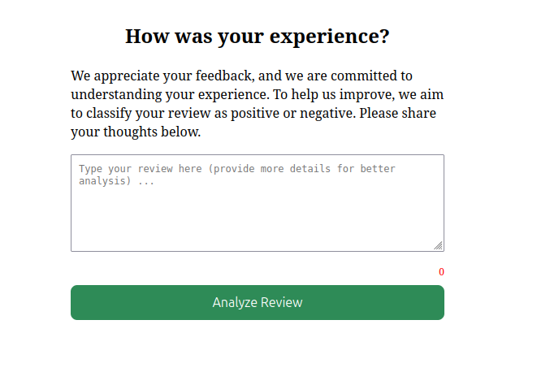
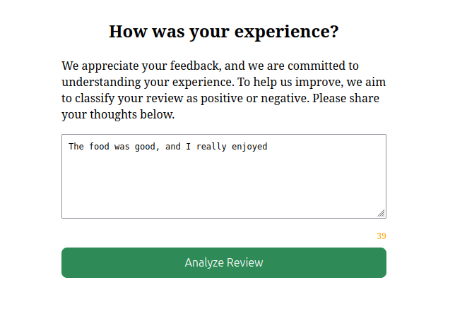
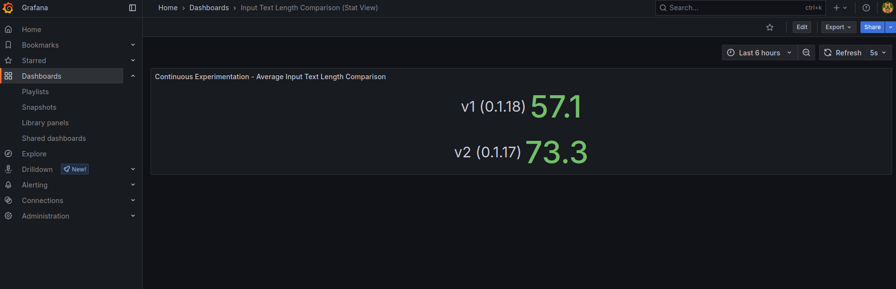

# Continuous Experimentation: Input Text Length Comparison

## Experiment Overview

This document describes an experiment comparing average input text length between two versions of our sentiment analysis app. The experiment aims to determine if adding a character counter to the UI in the newer version encourage users to provide longer and more detailed text inputs, which could improve sentiment analysis accuracy.

## Base Design vs. Experiment

### Base Design (v1)
The original version of the app (v1 or app service version 0.1.18) features a simple text input field with no visual cues on input length.

### Experiment Changes (v2)
The new version (v2 or app service version 0.1.17) introduces the following changes:
- A character counter below the input field showing the current text length
- The counter changes color depending on the length of the text (red if less than 20 characters, yellow if  20-40 characters, green if more than 40 characters)
- Increased the size of the input box to encourage more detailed responses
- Add a message in the UI encouraging more detailed responses

> **Note:**  
> The UI may occasionally display the incorrect version when the page is refreshed multiple times.  
> This issue occurs specifically when using 90/10 routing via the `VirtualService`, rather than routing based on the `x-user` header.  
> The likely cause is caching behavior.





## Falsifiable Hypothesis

**Hypothesis**: The UI changes in version 2 will result in users submitting longer text inputs 
compared to version 1.

## Relevant Metrics

We have implemented the following Prometheus metric to test our hypothesis:
**Average Input Text Length**: Measures the mean character count of submitted text for each version


## Deployments

The experiment involves two deployments:
- **app-service:v1** - The original version with the basic text input
- **app-service:v2** - The enhanced version with character counter and visual feedback

Both versions are deployed simultaneously using our Helm chart with Istio for traffic management. 
Traffic is split 90/10 between the two versions to ensure a fair comparison.

## Prometheus Configuration

The metrics are collected via Prometheus using the following instrumentation in our app service:


## Decision Process

The experiment will run for a few weeks to collect sufficient data. 
We will use the Grafana dashboard to analyze the results and make a decision based on the following criteria:
- Average input text length should be at least 25% higher in v2 compared to v1.

## Grafana Dashboard

Run the following commands to access the Grafana dashboard:
```bash
kubectl port-forward svc/prometheus-grafana 3000:80 -n default &
kubectl port-forward svc/prometheus-kube-prometheus-prometheus 9090:9090 -n default &
```

To manually import the app dashboard:
1. Log in to Grafana (http://localhost:3000). (default username: admin, default password: prom-operator)
2. Go to **Dashboards → Manage** → **Import**.
3. Paste the contents of `grafana/grafana_experiment.json`, click **Load**, then **Import**.
4. Select your Prometheus data source when prompted.

## Dashboard Visualization

Below is a screenshot of our Grafana dashboard showing the comparison between v1 and v2:

)
