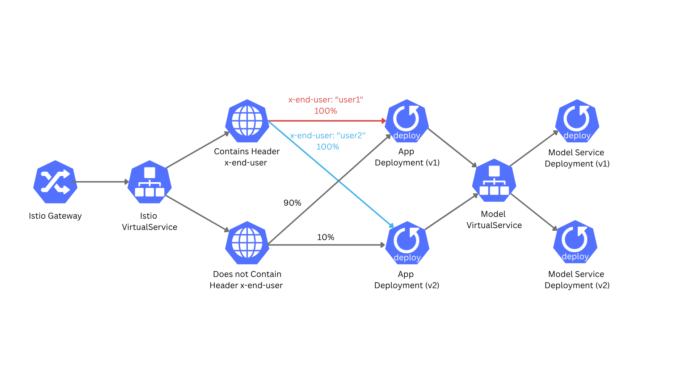

# Deployment documentation

## Overview

This document provides a comprehensive guide to understanding the deployment setup of the project. It is designed to help you quickly familiarize yourself with the architecture and data flow. The objective of this document is to provide a clear description of the deployment structure.

## Table of Contents

- [Deployment structure](#deployment-structure)
- [Data flow](#data-flow)

## [Deployment structure](#deployment-structure)

- Deployments: We are using one Deployment for the application and one for the model-service. We are also using multiple versions of the model-service to demonstrate canary deployments.
- Services: Each Deployment is associated with a Kubernetes Service. The app service is used to expose the application, while the model service is used to handle prediction requests.
- Istio Gateway: It is defined to manage HTTP traffic routing for the hostname app.local in a Kubernetes cluster. It listens on port 80 and routes traffic to the app VirtualService.
- VirtualService: The VirtualService defines routing rules for HTTP traffic. It routes requests to the app service and model service based on the request path. The app VirtualService additionally specifies a canary deployment strategy for the model service, by directing 90% of traffic to the v1 version and 10% to the v2 version.
- DestinationRule: The DestinationRule defines policies for the app and model services. While they does not currently configure additional setting, they can be used to specify load balancing strategies.
- EnvoyFilter: An Envoy filter is used to rate limit requests to the app service. This helps to prevent abuse and ensures fair usage of the service.

### Other components:

- Monitoring: Prometheus is used for monitoring the services, collecting metrics, and Grafana is used for visualizing these metrics. Configuring Prometheus involves setting up ServiceMonitors and PrometheusRules.
- ConfigMaps: ConfigMaps are used to store configuration data for various components, such as the envoy filters, Grafana dashboards and Alertmanager configurations.

## [Data flow](#data-flow)

### 1. **External Request Entry**

- A client sends an HTTP request to the cluster’s public IP (e.g., `app.local`).
- The request is received by the **Istio Gateway**.

### 2. **Gateway and VirtualService Routing**

- The **Istio Gateway** accepts the request on port 80. It then routes the request to the **Istio VirtualService** of the app service.

### 3. **App Service Communication**

- The **Istio VirtualService** checks for the field `x-end-user` in the request header. If this field is found as `x-end-user: "user1"`, then it is forwarded to v1 of the app, and in the case of `x-end-user: "user1"` to v2. If there is no `x-end-user` field in the header, the VirtualService splits the traffic: 90% to v1 and 10% to v2, for canary/weighted experiments.
- The selected **App Deployment** pod receives the request via the **App Service** (ClusterIP).

### 4. **Model Service Communication**

- The app will call the **Model Service** (via its ClusterIP service) for predictions.
- The **Istio VirtualService** for the model service routes requests to the appropriate version (v1 or v2) based on the source of the request.

### 5. **Rate Limiting**

- **EnvoyFilters** at the Istio ingress enforce per-user rate limits: 2 requests/minute per `x-end-user`.
- The rate limit configuration is stored in a ConfigMap and enforced before requests reach the app.

---
