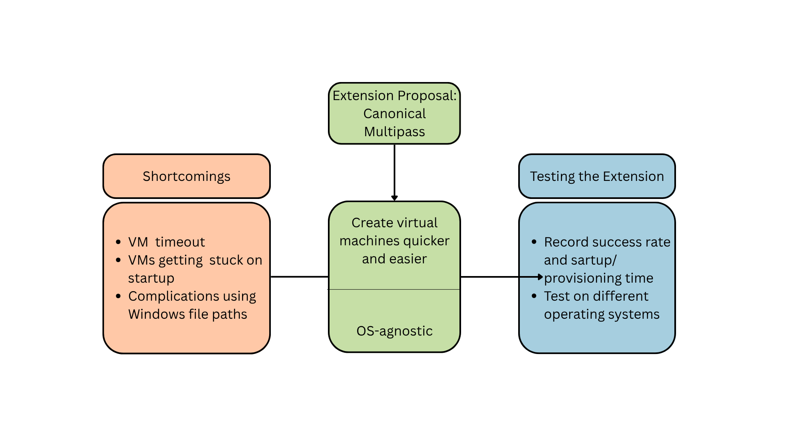

# Extension  Proposal

During the development of our project, we encountered several shortcomings with the current release engineering process. This document outlines these shortcomings and proposes an extension to improve the robustness and usability of the project's release engineering.

## Shortcomings

Our release engineering flaw has to do with the robustness of [Vagrant](https://developer.hashicorp.com/vagrant). During the duration of this course, Vagrant has given us several issues and complexities. Those issues are:

1. **Unreliable VM lifecycle management (VM start timeout)**.  Vagrant offers limited insight and control over the creation and management of VMs. This leads to the startup taking very long and internal processes of the program timing out. These timeouts are not handled well and require manual intervention to resolve by running `vagrant up` again. This not only wasted time and is inefficient, but also undermines our goal of automating the release engineering process. 

2. **VM's getting stuck in startup**. VM's have quite a significant chance to get stuck when starting up. This may also contribute to the problem mentioned above. Only when opening virtual box and manually inspecting the VM's they start operating normally again. (Note: this issue is OS-specific, for example, using Windows. For MacOS, this issue did not occur.)

3. **Complications using Windows file paths**.
    By default Vagrant creates a `.vagrant` folder on the host PC at the file path where the `vagrant up` command was used. Then it creates a simple key pair that is used to connect to the virtual machine easily. When connecting Vagrant with [Ansible](https://docs.ansible.com/) this could lead to an error, because Ansible has protection against using SSH keys that are in a folder with certain [Posix](https://en.wikipedia.org/wiki/POSIX) permissions enabled. Of course in Vagrant we can `chmod` after creating the VM but when vagrant is used in a Windows file path, `chmod` does not work. While we can use chmod to adjust file permissions in Unix-like systems, this command doesn't work properly on Windows file paths. To address this, our team wrote a script that:
    - Generates a new SSH key.
    - Moves it to a Linux home directory (so it works with [WSL](http://en.wikipedia.org/wiki/Windows_Subsystem_for_Linux)).
    - Applies proper permissions with `chmod`.
    - Copies the public key to the VM on startup.

     Next we had to disable the default automatic key generation in the `.vagrant` folder otherwise Ansible would still return an error. This seems very complicated and should be simpler in our eyes. A [thread on Stackoverflow](https://stackoverflow.com/questions/29021246/ssh-fails-due-to-key-file-permissions-when-i-try-to-provision-a-vagrant-vm-with) contains people with the same struggles. One of the users validly reports *"...why is is Ansible's business to check ssh checks ??"* which exactly describes our thoughts when it comes to this problem. 

These shortcomings impact the usability and automaion capabilities of Vagrant and Ansible. It takes time to start the virtual machines and requires manual inspection to make sure the VMs are not stuck. Furthermore, when one VM fails or times-out just running `vagrant up` makes it timeout again. The only way to try again is to do `vagrant destroy` and delete the images from virtual box and delete the `.vagrant` folder. Only then you can try to start it again and hope it will this time run all VMs without problems.

## Solution Proposal

A possible extension that could fix these shortcomings is the use of [Canonicals Multipass](https://canonical.com/multipass) VM system which can create virtual machines quicker and easier and can be provisioned automatically or manually. This makes it easy to integrate and understand for students taking the REMLA course. To create VMs it only takes seconds. Furthermore, it is OS-agnostic, meaning it will not have OS dependent functionality like Vagrant's connection with Ansible using the unprotected private key. There exists [great documentation](https://documentation.ubuntu.com/multipass/en/latest/) which can be understood by any level of developer and an accompanying [github repository](https://github.com/canonical/multipass). It can work with [Hyper-V](https://en.wikipedia.org/wiki/Hypervisor), [VirtualBox](https://www.virtualbox.org/), [QEMU](https://www.qemu.org/) and Linux's native virtualization system. 

This extension would allow us to create a more robust and user-friendly release engineering process. A visualization of the proposed solution is shown below:

## Testing the Extension

To test the robustness of using Canonicals Multipass, we suggest the following evaluation plan:
1. **Provisioning Success Rate**: Record the success rate of starting and provisioning VM's and record their startup and provisioning time. 
2. **Startup Latency**: Record the time required to fully initialize and provision VM instances.
3. **Test OS-agnostic behaviour**: Test the provisioning on different operating systems like Windows, MacOS, Linux, but also on WSL with Windows file paths. 

With these validation steps, we can more accurately decide if the migration from Vagrant to Multipass sufficiently addresses the shortcomings we encountered during the course.

## Resources
- [StackOverflow: SSH key file permissions issue](https://stackoverflow.com/questions/29021246/ssh-fails-due-to-key-file-permissions-when-i-try-to-provision-a-vagrant-vm-with)
- [Canonical Multipass Documentation](https://documentation.ubuntu.com/multipass/en/latest/)
- [Multipass GitHub Repository](https://github.com/canonical/multipass)